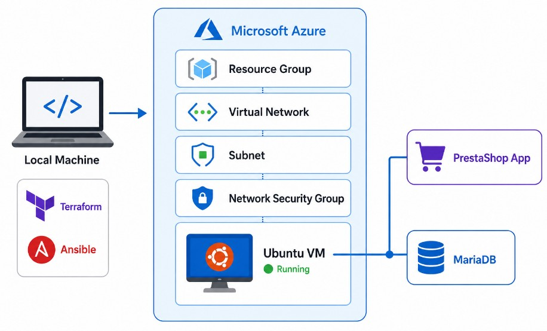

# PrestaShop on Azure — Infrastructure as Code with Terraform and Ansible

## Overview

This project sets up a complete cloud environment on Microsoft Azure from scratch
using Terraform to handle the infrastructure and Ansible to configure the server
and deploy the application. The end result is a running PrestaShop e-commerce
store backed by a MariaDB database, all hosted on a Linux virtual machine in the
France Central region.

The goal was to move away from clicking through the Azure Portal and instead
define every resource in code, so the entire environment can be rebuilt or torn
down with a single command.

## Architecture

The diagram below shows how the components fit together, from the local machine
running Terraform and Ansible through to the containers running inside the Azure VM.

## What Terraform Provisions

All resources are created in the France Central region inside a dedicated resource
group. Terraform sets up a virtual network with a subnet, a static public IP
address, a network security group that opens ports 22, 80 and 443, a network
interface that ties everything together, and finally the Linux virtual machine
itself. The public IP is printed as an output at the end of the apply step, which
is then used in the Ansible inventory.

## What Ansible Deploys

Once the VM is up, the Ansible playbook connects over SSH and takes care of
everything on the server side. It installs Docker and Docker Compose, creates a
working directory, writes a Docker Compose file, and brings up two containers.
One container runs the PrestaShop application and the other runs MariaDB. The
database credentials are passed in as environment variables and the database
data is kept safe using a Docker volume so it survives container restarts.

## Project Structure

main.tf — core Terraform configuration defining all Azure resources
variables.tf — variable declarations for all configurable values
terraform.tfvars.example — example values file showing what inputs are needed
inventory.ini — Ansible inventory pointing to the provisioned VM
playbook.yml — Ansible playbook that installs Docker and deploys the application

## How to Use This Project

Start by copying terraform.tfvars.example to terraform.tfvars and filling in
your own values, including your preferred VM size, admin credentials, and
resource names. Then authenticate with Azure using the CLI, run terraform init
to set up the providers, and run terraform apply to build the infrastructure.
Once Terraform finishes, copy the public IP it outputs into the inventory.ini
file and run the Ansible playbook to deploy PrestaShop onto the VM.

## Security Note

The terraform.tfvars file is excluded from this repository via .gitignore because
it contains credentials. The example file is provided in its place so anyone
using this project knows exactly what values to supply without any sensitive
information being exposed.